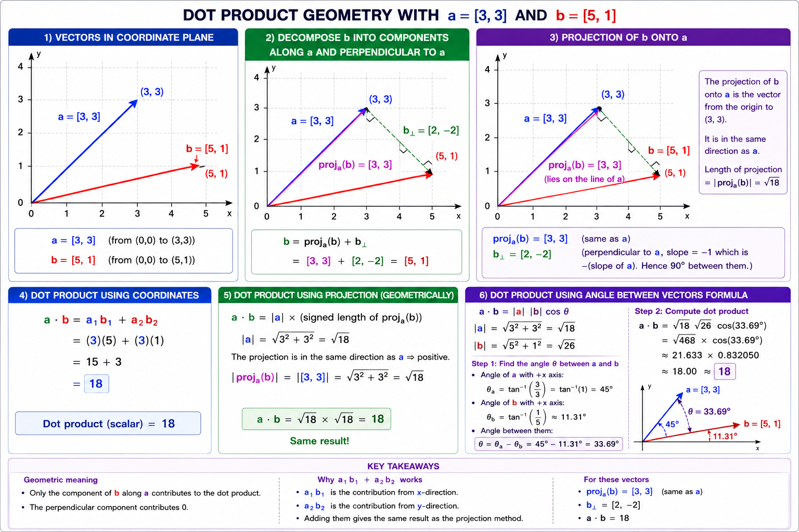

# Appendix — The Dot Product Operation Bible

> A durable reference for the ideas developed in the Day 2 discussion. The goal is not to remember a recipe; it is to be able to reconstruct the meaning, the formula, and the appropriate operation from first principles.

## Contents

1. [The one-minute version](#the-one-minute-version)
2. [Vectors, points, and representations](#vectors-points-and-representations)
3. [The calculation rule](#the-calculation-rule)
4. [Magnitude: vector length, not a second vector](#magnitude-vector-length-not-a-second-vector)
5. [The geometric formula and alignment scale](#the-geometric-formula-and-alignment-scale)
6. [Projection: the most useful picture](#projection-the-most-useful-picture)
7. [Worked example: `a = [3, 3]`, `b = [5, 1]`](#worked-example-a--3-3-b--5-1)
8. [Cosine similarity and normalization](#cosine-similarity-and-normalization)
9. [Why equal dot products need not mean equal alignment](#why-equal-dot-products-need-not-mean-equal-alignment)
10. [Physics analogies: force, resultant force, and work](#physics-analogies-force-resultant-force-and-work)
11. [Dot product vs. vector addition, linear combinations, and matrix multiplication](#dot-product-vs-vector-addition-linear-combinations-and-matrix-multiplication)
12. [Common traps and repaired mental models](#common-traps-and-repaired-mental-models)
13. [Derivations and useful consequences](#derivations-and-useful-consequences)
14. [Practice / midnight-recall prompts](#practice--midnight-recall-prompts)
15. [Original image resource and correction record](#original-image-resource-and-correction-record)

---

## The one-minute version

For real vectors of the same dimension,

\[
\mathbf a\cdot\mathbf b = \sum_i a_i b_i
=\|\mathbf a\|\,\|\mathbf b\|\cos\theta.
\]

The dot product returns **one scalar (one signed number)**, not a vector and not a point in the coordinate plane.

Its deepest mental model is:

> **Dot product = magnitude × magnitude × alignment.**

Equivalently:

> **Dot product = length of one vector × signed projection of the other onto its direction.**

The words “one vector” and “the other” do not make the operation asymmetric: `a · b = b · a`. They are two equally valid projection stories for the same scalar.

If the actual question is only “How similarly do these arrows point?”, divide away both lengths:

\[
\operatorname{cosine\ similarity}(\mathbf a,\mathbf b)
= \frac{\mathbf a\cdot\mathbf b}{\|\mathbf a\|\|\mathbf b\|}
=\cos\theta,
\]

for nonzero vectors. This is the **normalized dot product**. It is not `a · b · cos θ`.

---

## Vectors, points, and representations

### A vector is a displacement

`[3, 2]` means “move 3 units right and 2 units up.” If its tail is at `(0, 0)`, its head is at `(3, 2)`. If its tail is at `(5, 4)`, its head is at `(8, 6)`. The vector is the same in both drawings because the displacement is the same:

\[
\Delta x=3,\qquad \Delta y=2.
\]

The tail can be translated freely. A vector does **not** intrinsically require the origin; drawing it from the origin is a convenient convention.

| Object | Meaning | Example | Does location matter? |
|---|---|---|---|
| Point | “Where is it?” | `(3, 2)` | Yes |
| Vector | “How far and in what direction?” | `[3, 2]` | No; it may be translated |
| Column representation | A notation for a vector | `[[3], [2]]` | No new object is created |

The row `[3, 2]` and column \(\begin{bmatrix}3\\2\end{bmatrix}\) often represent the same abstract vector. The orientation is selected to make multiplication notation valid; it does not turn a vector into a different geometric thing.

### What a dot product does not do

Vector addition produces a new arrow:

\[
\mathbf a+\mathbf b=\text{a resultant vector}.
\]

The dot product instead compresses a relationship between two vectors into a number:

\[
\mathbf a\cdot\mathbf b=\text{a scalar}.
\]

There is no endpoint at which a dot-product result “lands” in the plane. A positive result, zero, and a negative result describe the directional relationship, scaled by length.

---

## The calculation rule

For two vectors with matching numbers of components,

\[
\mathbf a=[a_1,a_2,\ldots,a_n],\qquad
\mathbf b=[b_1,b_2,\ldots,b_n],
\]

their dot product is

\[
\boxed{\mathbf a\cdot\mathbf b=a_1b_1+a_2b_2+\cdots+a_nb_n.}

In two dimensions,

\[
[a_1,a_2]\cdot[b_1,b_2]=a_1b_1+a_2b_2.
\]

This is the **coordinate calculation**. It is not a separate operation from the geometric picture. It is exactly how the projection-and-alignment quantity is computed in standard perpendicular coordinate axes.

Example:

\[
[2,3]\cdot[4,1]=(2)(4)+(3)(1)=11.
\]

The `x` contributions agree by `2×4`; the `y` contributions agree by `3×1`; adding gives the total signed agreement in the coordinate basis.

### Essential algebraic properties

For real vectors \(\mathbf a,\mathbf b,\mathbf c\) and scalar \(k\):

\[
\mathbf a\cdot\mathbf b=\mathbf b\cdot\mathbf a \quad\text{(symmetry)}
\]
\[
\mathbf a\cdot(\mathbf b+\mathbf c)=\mathbf a\cdot\mathbf b+\mathbf a\cdot\mathbf c \quad\text{(distributes)}
\]
\[
(k\mathbf a)\cdot\mathbf b=k(\mathbf a\cdot\mathbf b)=\mathbf a\cdot(k\mathbf b)
\]
\[
\mathbf a\cdot\mathbf a=\|\mathbf a\|^2\ge0.
\]

The final identity says a vector dotted with itself is its **squared length**, not its length and not the distance between two vectors.

---

## Magnitude: vector length, not a second vector

The magnitude (also written norm or length) of \(\mathbf v=[v_1,v_2]\) is

\[
\|\mathbf v\|=\sqrt{v_1^2+v_2^2}.
\]

For \(\mathbf v=[3,4]\),

\[
\|\mathbf v\|=\sqrt{3^2+4^2}=5.
\]

When the arrow begins at the origin, 5 is the distance from `(0, 0)` to its head `(3, 4)`. More generally, it is the distance from the vector’s tail to its head.

So retain this precise wording:

> **Vector magnitude = length of the vector = distance from tail to head.**
>
> If the tail is at the origin, it is the distance from the origin to the head.

Do not say “distance between the two vectors.” Vectors are displacements, not fixed locations. If two points \(P\) and \(Q\) are given, the displacement vector from `P` to `Q` is \(Q-P\), and its magnitude is the distance between those **points**.

In `n` dimensions:

\[
\|\mathbf v\|=\sqrt{v_1^2+\cdots+v_n^2}.
\]

---

## The geometric formula and alignment scale

Let \(\theta\) be the angle **between** two nonzero vectors, in the range \([0^\circ,180^\circ]\). Then

\[
\boxed{\mathbf a\cdot\mathbf b=\|\mathbf a\|\|\mathbf b\|\cos\theta.}

The three factors have separate jobs:

| Factor | Meaning |
|---|---|
| \(\|\mathbf a\|\) | length of the first arrow |
| \(\|\mathbf b\|\) | length of the second arrow |
| \(\cos\theta\) | signed directional alignment |

The cosine is an alignment scale, not a special-purpose test only for vectors already known to be parallel.

| Angle | Cosine | Meaning |
|---:|---:|---|
| \(0^\circ\) | 1 | same direction |
| \(30^\circ\) | \(\sqrt3/2\approx0.866\) | strongly aligned |
| \(60^\circ\) | 0.5 | partly aligned |
| \(90^\circ\) | 0 | perpendicular / orthogonal |
| \(120^\circ\) | −0.5 | partly opposing |
| \(180^\circ\) | −1 | opposite direction |

Consequences:

- Perpendicular nonzero vectors have dot product 0, regardless of their lengths.
- A negative dot product means the angle is obtuse: the vectors have a net opposing directional relationship.
- A positive dot product means the angle is acute.
- Perfectly aligned vectors can have different raw dot products, because their lengths can differ.

---

## Projection: the most useful picture

Choose \(\mathbf a\) as a reference direction. Decompose \(\mathbf b\) into:

\[
\mathbf b=\mathbf b_{\parallel}+\mathbf b_{\perp},
\]

where \(\mathbf b_{\parallel}\) is parallel to \(\mathbf a\), and \(\mathbf b_{\perp}\) is perpendicular to \(\mathbf a\).

The vector \(\mathbf b_{\parallel}\) is the **vector projection of \(\mathbf b\) onto \(\mathbf a\)**. It lies along the line/direction of \(\mathbf a\). It is **not** generally a horizontal x-axis projection.

The signed scalar length of that projection is

\[
\operatorname{comp}_{\mathbf a}(\mathbf b)
=\|\mathbf b\|\cos\theta
=\frac{\mathbf a\cdot\mathbf b}{\|\mathbf a\|},
\]

provided \(\mathbf a\ne\mathbf0\). The dot product is therefore

\[
\boxed{\mathbf a\cdot\mathbf b
=\|\mathbf a\|\,\operatorname{comp}_{\mathbf a}(\mathbf b).}

The perpendicular component contributes nothing:

\[
\mathbf a\cdot\mathbf b_\perp=0.
\]

The full vector projection is

\[
\boxed{\operatorname{proj}_{\mathbf a}(\mathbf b)
=\frac{\mathbf a\cdot\mathbf b}{\mathbf a\cdot\mathbf a}\mathbf a}
\]

for \(\mathbf a\ne0\). Keep the three objects separate:

| Object | Type | Meaning |
|---|---|---|
| \(\operatorname{proj}_{\mathbf a}(\mathbf b)\) | vector | the “shadow arrow” along `a` |
| \(\operatorname{comp}_{\mathbf a}(\mathbf b)\) | signed scalar | length of that shadow, positive/negative by direction |
| \(\mathbf a\cdot\mathbf b\) | scalar | projection length multiplied by \(\|a\|\) |

Because symmetry holds, the equally valid reverse story is \(\|b\|\) times the signed projection of \(a\) onto the direction of \(b\).

---

## Worked example: `a = [3, 3]`, `b = [5, 1]`

This pair appeared repeatedly in the discussion. Verify it three compatible ways.

### 1. Coordinate calculation

\[
\mathbf a\cdot\mathbf b=(3)(5)+(3)(1)=15+3=\boxed{18}.
\]

### 2. Lengths

\[
\|a\|=\sqrt{3^2+3^2}=\sqrt{18}=3\sqrt2\approx4.242640687,
\]

\[
\|b\|=\sqrt{5^2+1^2}=\sqrt{26}\approx5.099019514.
\]

### 3. Angles from the x-axis, then the angle between the arrows

For `a`,

\[
\tan\alpha=\frac{3}{3}=1\quad\Rightarrow\quad\alpha=45^\circ.
\]

For `b`,

\[
\tan\beta=\frac{1}{5}\quad\Rightarrow\quad
\beta=\arctan(1/5)\approx11.30993247^\circ.
\]

Thus the angle in the **dot-product formula** is the angle between `a` and `b`:

\[
\theta=45^\circ-11.30993247^\circ
=\boxed{33.69006753^\circ}.
\]

It is not the `11.31°` angle of `b` from the x-axis.

### 4. Geometric calculation

\[
\cos\theta
=\frac{a\cdot b}{\|a\|\|b\|}
=\frac{18}{\sqrt{18}\sqrt{26}}
=\frac{3}{\sqrt{13}}
\approx0.8320502943.
\]

Therefore,

\[
\sqrt{18}\,\sqrt{26}\cos(33.69006753^\circ)
=\boxed{18}.
\]

The coordinate rule, the angle formula, and the projection view are not competing answers; they are three views of this same scalar.

### 5. Exact projection of `b` onto `a`

\[
\operatorname{proj}_a(b)
=\frac{a\cdot b}{a\cdot a}a
=\frac{18}{18}[3,3]
=\boxed{[3,3]}=a.
\]

So the user’s visual observation was exactly correct: `b` decomposes as

\[
b=[5,1]=[3,3]+[2,-2].
\]

The first part is parallel to `a`; the second is perpendicular because

\[
[3,3]\cdot[2,-2]=6-6=0.
\]

Thus `b`’s projection onto the direction of `a` is exactly `a` itself. Its signed projection length is \(\|a\|=\sqrt{18}\), and

\[
\|a\|\times\sqrt{18}=18.
\]

---

## Cosine similarity and normalization

Raw dot product answers a magnitude-sensitive question. If the desired question is “How aligned are the directions regardless of arrow length?”, use cosine similarity:

\[
\boxed{\cos\theta=\frac{a\cdot b}{\|a\|\|b\|}.}

This requires nonzero vectors. A zero vector has no direction, so ordinary cosine similarity with it is undefined (software may choose a convention, but that is not the mathematics).

### Normalizing to a unit vector

To normalize a nonzero vector, divide every component by its magnitude:

\[
\hat a=\frac{a}{\|a\|}.
\]

It points in the same direction but has length 1. Geometrically: **shrink or stretch the arrow without rotating it.**

For the worked pair,

\[
\hat a=\left[\frac3{\sqrt{18}},\frac3{\sqrt{18}}\right],\qquad
\hat b=\left[\frac5{\sqrt{26}},\frac1{\sqrt{26}}\right].
\]

Then

\[
\hat a\cdot\hat b
=1\times1\times\cos\theta
=\cos\theta
=\frac3{\sqrt{13}}
\approx\boxed{0.8320502943}.
\]

Two correct, equivalent descriptions are:

1. Divide the raw dot product by the product of the two magnitudes.
2. Normalize each nonzero vector to unit length, then take their dot product.

Avoid the phrase **“normalized magnitudes.”** The operation is **vector normalization** (or unit-vector normalization). In statistics/ML, “standardization” usually means a different operation such as subtracting a mean and dividing by a standard deviation.

### Comparison table

| Question | Operation | Does length matter? | Output |
|---|---|---:|---|
| How much magnitude is mutually aligned? | \(a\cdot b\) | Yes | unbounded scalar |
| How similarly do they point? | \((a\cdot b)/(\|a\|\|b\|)\) | No | scalar in \([-1,1]\) |

For `[3, 0]` against `[5, 0]`, raw dot product is 15; against `[6, 0]`, it is 18. Both cosine similarities are 1 because both pairs point in exactly the same direction.

---

## Why equal dot products need not mean equal alignment

Let `a` and `b₁` both have length \(L\) and point in the same direction. Let `b₂` have length \(2L\) and be at \(60^\circ\) to `a`.

\[
a\cdot b_1=L\cdot L\cdot\cos0^\circ=L^2,
\]

\[
a\cdot b_2=L\cdot(2L)\cdot\cos60^\circ
=L\cdot2L\cdot\frac12=L^2.
\]

So the raw dot products are equal although the directional relationships differ. The extra length of `b₂` exactly compensates for its weaker alignment.

This is why this statement is false:

> “A larger dot product always means better directional alignment.”

It may mean better alignment, larger magnitudes, or a mixture. Cosine similarity distinguishes the two cases:

\[
\cos0^\circ=1,\qquad\cos60^\circ=0.5.
\]

---

## Physics analogies: force, resultant force, and work

### The analogy that is wrong

Two equal dot products do **not** imply equal resultant forces. Resultant force is vector addition, not dot product.

In the preceding example, treating the vectors as forces gives:

\[
\|a+b_1\|=2L,
\]

while

\[
\|a+b_2\|
=\sqrt{L^2+(2L)^2+2(L)(2L)\cos60^\circ}
=\sqrt7L.
\]

Since \(2L\ne\sqrt7L\), the resultants are different. Replace “the net resultant force is the same” with:

> **The component of the second vector along the reference direction is the same, so its dot product with that reference vector is the same.**

### The analogy that is excellent: work

Mechanical work is

\[
W=\mathbf F\cdot\mathbf d.
\]

It measures the component of force along displacement, scaled by the displacement length. A force perpendicular to displacement does no work in this idealized formula. A force twice as large but only half aligned can do the same work over the same displacement as a smaller, fully aligned force.

This is not merely a metaphor: it is a direct physical use of the dot product.

---

## Dot product vs. vector addition, linear combinations, and matrix multiplication

### Vector addition and linear combinations

\[
2u- v
\]

is a linear combination: scale vectors, then add them component by component. It produces a vector. Example:

\[
u=[1,2],\quad v=[3,-1],\quad 2u-v=[2,4]+[-3,1]=[-1,5].
\]

It answers: “What new displacement/vector can be constructed from these directions and weights?”

### Dot product

\[
u\cdot v
\]

multiplies corresponding components and adds them. It produces a scalar. It answers: “How much magnitude is mutually aligned?”

| Operation | Example form | Output | Geometric role |
|---|---|---|---|
| Addition | `u + v` | vector | combine displacements |
| Linear combination | `x₁v₁ + x₂v₂ + ...` | vector | build a resultant from directions |
| Dot product | `u · v` | scalar | magnitude-weighted directional relationship |
| Cosine similarity | `(u · v)/(||u||||v||)` | scalar | direction-only relationship |

### Matrix–vector multiplication

If `A` has columns \(v_1,v_2,\ldots,v_n\) and \(x=[x_1,\ldots,x_n]^T\), then

\[
\boxed{Ax=x_1v_1+x_2v_2+\cdots+x_nv_n.}
\]

So matrix–vector multiplication is a linear combination of the **columns** of the matrix. It is not a dot product, even though each output entry can also be calculated as the dot product of a row of `A` with `x`.

Both row and column views are valid:

- **Column view:** which weighted columns construct the output vector?
- **Row view:** each output coordinate is the dot product of one row with `x`.

The column view is not inherently iterative or trial-and-error; it is an exact identity. Solving `Ax=b` for an unknown `x` is a separate inverse problem: find the weights that create target `b`.

### A dimension correction

A dot product of two same-length vectors (viewed as a row times a column) is a `1×1` matrix, conventionally identified with a scalar. Matrix multiplication does **not** always produce a matrix or vector with multiple entries: it can produce this `1×1` scalar. In general, an \(m\times n\) matrix times an \(n\times p\) matrix produces an \(m\times p\) matrix.

---

## Common traps and repaired mental models

| Old path / tempting claim | Why it fails | Durable replacement |
|---|---|---|
| “Dot product is alignment.” | It hides vector lengths. | **Dot product is magnitude-weighted alignment.** |
| “If fully aligned, magnitude should not matter.” | Correct only if asking pure direction. | Use cosine similarity for direction-only comparison. |
| “Cosine similarity is `u·v·cos θ`.” | This multiplies in an extra cosine. | \(\cos\theta=(u\cdot v)/(\|u\|\|v\|)\). |
| “Normalize the magnitudes.” | Imprecise terminology. | Normalize the **vectors** to unit length. |
| “Projection onto `a` means horizontal projection.” | The x-axis is unrelated unless `a` lies on it. | Drop a perpendicular to the **line in `a`’s direction**. |
| “The dot product is the projected arrow.” | One is a vector; one is a number. | Projection is a vector; dot product is length × signed projection length. |
| “`v·v` is distance.” | It is squared length. | \(v\cdot v=\|v\|^2\); length is \(\|v\|\). |
| “Equal dots imply equal alignment/resultant force.” | Different length-angle combinations can compensate; resultants use addition. | Equal dots mean equal scalar projection-weighted quantity. |
| “A vector must begin at the origin.” | Confuses a vector with a point. | A vector is displacement; origin drawings are conventional. |
| “Dot product lands somewhere in the plane.” | It is scalar-valued. | It is a score, signed length-related quantity, or work-like quantity. |
| “Correlation and cosine similarity are identical.” | Statistical correlation includes centering and has its own definition. | Cosine similarity is normalized directional dot product. |

### A small but important caution about “similarity”

Cosine similarity is often useful for embeddings because direction may encode a useful relationship while norm is not desired. But whether norm should be discarded depends on the application. Raw dot products intentionally preserve magnitude and are used, for example, in attention compatibility scores. “Cosine is better” is not universal; it answers a different question.

---

## Derivations and useful consequences

### Deriving cosine from the dot product

For nonzero vectors, start with

\[
a\cdot b=\|a\|\|b\|\cos\theta.
\]

Divide by \(\|a\|\|b\|\):

\[
\boxed{\cos\theta=\frac{a\cdot b}{\|a\|\|b\|}.}

This shows exactly why normalization “removes magnitude”: the length product in the dot product cancels with the denominator.

### Dotting a vector with itself

The angle from a nonzero vector to itself is zero, so

\[
a\cdot a=\|a\|\|a\|\cos0=\|a\|^2.
\]

Coordinate check:

\[
[a_1,\ldots,a_n]\cdot[a_1,\ldots,a_n]=a_1^2+\cdots+a_n^2.
\]

### Distance between two points via a dot product

For points \(P\) and \(Q\), form displacement \(d=Q-P\). Then

\[
\operatorname{distance}(P,Q)=\|d\|=\sqrt{d\cdot d}.
\]

This is where dot product connects to distance. It does **not** mean a generic `a·b` is a distance.

### Angle test without drawing

For nonzero vectors:

- `a·b > 0` means acute angle.
- `a·b = 0` means perpendicular.
- `a·b < 0` means obtuse angle.

### Cauchy–Schwarz bound

Because \(-1\le\cos\theta\le1\),

\[
|a\cdot b|\le\|a\|\|b\|.
\]

This tells us a dot product cannot exceed the product of lengths in absolute value. Equality happens exactly when the nonzero vectors are parallel or anti-parallel.

---

## Practice / midnight-recall prompts

Try to answer without calculation before checking.

1. What is the output type of a dot product? Where does it “land” geometrically?
2. State the two equivalent dot-product formulas.
3. In “magnitude × magnitude × alignment,” what does each magnitude mean?
4. What is the difference between a point `(3, 2)` and vector `[3, 2]`?
5. Why is `a·b = b·a`, although projection explanations choose a reference vector?
6. What is `v·v`? How do you obtain `||v||` from it?
7. What does a negative dot product say about the angle?
8. Why can `[3,0]·[5,0]` and `[3,0]·[6,0]` differ although both pairs are perfectly aligned?
9. How do you normalize `[3,3]`? What changes and what does not?
10. What is wrong with calling cosine normalization “standardization” in this context?
11. A vector `b` is projected onto diagonal vector `a`. Where must the projected arrow lie?
12. What is the difference between the vector projection, scalar component, and dot product?
13. Why does `a·b₁ = a·b₂` not mean `a+b₁ = a+b₂`?
14. State the work formula and its projection interpretation.
15. What is the column interpretation of `Ax`? What is the row interpretation?

### Answer key, condensed

1. A scalar; nowhere as an endpoint. 2. \(\sum_i a_ib_i\) and \(\|a\|\|b\|\cos\theta\). 3. Arrow lengths. 4. Location vs displacement. 5. Both projection descriptions produce the same scalar. 6. \(\|v\|^2\); take square root. 7. Obtuse/opposing. 8. Raw dot includes magnitude. 9. Divide by \(\sqrt{18}\); direction stays, length becomes 1. 10. Normalization and statistical standardization are different. 11. Along `a`, not automatically along x-axis. 12. Vector shadow / signed shadow length / reference length times signed shadow length. 13. Dot is not vector addition. 14. \(W=F\cdot d\), force component along displacement. 15. Weighted columns / row-dot-vector output coordinates.

---

## Dot Product Explainer

[Open the original PNG resource](resources/dot-product-operation-reference.png)

---

## Final mental-model card

> **A vector is a displacement: direction plus length.**
>
> **Dot product = magnitude × magnitude × alignment.**
>
> **Projection view: keep only the part of one vector that lies along the other’s direction; the perpendicular part contributes zero.**
>
> **Dot product returns a scalar, not a resultant arrow.**
>
> **Cosine similarity is the dot product after vector lengths are removed, so it measures only directional alignment.**

